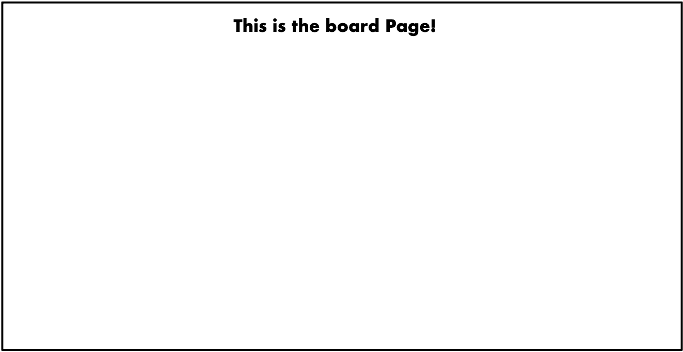

# MineSweeper

## Introduction
Minesweeper is a single-player puzzle video game. The objective of the game is to clear a rectangular board containing hidden “mines” without detonating any of them, with help from clues about the number of neighboring mines in each field. The game originates from the 1960s, and it has been written for many computing platforms in use today. It has many variations and offshoots.
 

## Our rules of MineSweeper
* Click “Start Game” to begin the game.
* Use the **left click button** on the mouse to select a space on the grid. If you hit a bomb, you lose.
* The numbers on the board represent how many bombs are adjacent to a square. For example, if a square has a “3” on it, then there are 3 bombs next to that square. The bombs could be above, below, right left, or diagonal to the square.
* Avoid all the bombs and expose all the empty spaces to win MineSweeper.
    * Use the numbers to determine where you know a bomb is.
    * You can **right click** a square with the mouse to **place a flag** where you think a bomb is. This allows you to avoid that spot.

## Structures and Diagrams


## TODOs
### TODO 1 -- MineSweeper.js (10%)
* Implement MineSweeper.js by finishing the four functions in MineSweeper.js and the MineSweeper component(10%)
    - You can refer to the file structure to finish the four functions.
    - ```startGameOnClick``` is a function to make the game start and also make the screen switch from HomePage to Board. (1%)
    - ```mineNumOnChange``` and ```boardSizeOnChange``` are two functions to make the game customized and change the input value synchronously. (1%, 1%)
    - ```backToHomeOnClick``` will be used in Modal to make the page back into HomePage and reset all the settings. (2%)
    - Show the Board when startGame is true, else show the HomePage. (5%)

### TODO 2 -- HomePage Start (5%)
* Make sure you can load the HomePage and start a game when pressing the “Start Game” button. (5%)
    - This HomePage.js is empty now and you will only see a title “MineSweeper” if you try to implement this project.
    - The structure of this page is shown in next page, please follow the diagram strictly.
        - As a reminder, this TODO only contains the “Start Game” button and the reaction of pressing this button.
        - After you press the “Start Game” button, you will see the page as below.
        
        

### TODO 3 -- createBoard.js (10%)
* Counting the value of each cell in the Board to complete createBoard.js. (10%)
    - The value is the number of mines around the cell. The definition of the position is shown in the left figure below. 
    - Take the right figure below as an example. Since the value of “Top-Left” and “Right” of the yellow block is ‘💣’, so the value of the yellow block must be set to “2”.
    - You can use the function printBoard for testing.
    

### TODO 4 -- Board.js (35%)
1. Use the function in createBoard.js to implement ```freshBoard``` and ```restartGame```(5%)
2. Implement the Board using the component Cell in Cell.js which has already done and Dashboard in Dashbard.js. (10%)
    * The board is built by 2-dimensional Cell. So, two ‘map’ and two ’return’ may be used to implement the board.
    * Follow the diagram in next page strictly.
    
3. Implement the function ```updateFlag``` of right click to flag a cell. (10%)
    * If the cell is already flagged, you should unflagged it.
    * Also remember to update the board and the ```remainFlagNum```. 
4. Complete the revealCell function. (10%)
    * If the cell has revealed or the cell is flagged or the game is over, do not reveal the cell.
    * You should consider two conditions:
        - If the cell you want to reveal is one of the mines’ location, show all the mines that have not been flagged and lose the game.
        - Simply revealed the cell. You should also consider if the revealed of this cell will result in winning the game.

### TODO 5 -- reveal.js (10%)
1. If the cell is already revealed, do nothing. And if the value of the cell is not 0, only show the cell value. (5%)
2. If the value of the cell is 0, you should try to find the values of adjacent cells until the value we found is not 0. (5%)
    * As an example or a hint: You can consider the adjacent cells respectively. If the value of any adjacent cell is 0, that cell must be revealed. Perhaps, you can consider this question into two part. One is to check the value of each adjacent cell. The other is to reveal the cells that must be revealed at the same time.

### TODO 6 -- Modal.js (10%)
* Implement the Modal. (10%)
    - The structure of Modal must follow the diagram in next page strictly.
    

### TODO 7 -- HomePage Control (15%)
* Try to implement a button called “Difficulty Adjustment” and its functions. (5% for structure, 5% for input value update, 5% for error checking)
    * Initially, the control panel is invisible. [showPanel = false]
    * If you press the “Difficulty Adjustment” button, the control panel will show under the button. And then, if you press it again, the control panel will be invisible as expected.
    * In the control panel, you should implement two input sliders (see p.5 for detailed structure). The two input sliders can control the number of mines and the board size of the game. (1 ≤ mineNum ≤ 50, 1 ≤ boardSize ≤ 20)
    * If the two input values are invalid to build a new game which means that the number of mines is bigger than the square of board size, show the Error messages and change the value of input sliders into darkred.
    

### 