# MineSweeper
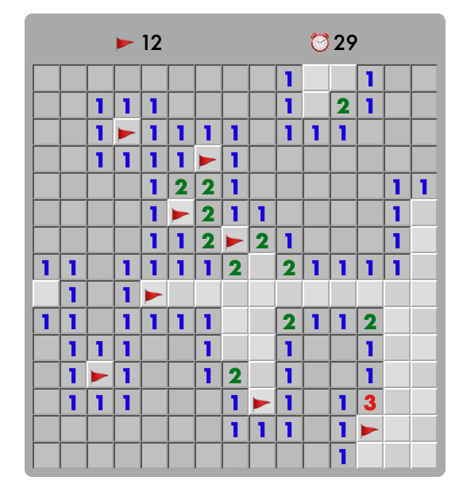

## Deployment
[mineSweeper](https://anitalu724.github.io/mineSweeper/)

## Introduction
Minesweeper is a single-player puzzle video game. The objective of the game is to clear a rectangular board containing hidden “mines” without detonating any of them, with help from clues about the number of neighboring mines in each field. The game originates from the 1960s, and it has been written for many computing platforms in use today. It has many variations and offshoots.
 

## Our rules of MineSweeper
* Click “Start Game” to begin the game.
* Use the **left click button** on the mouse to select a space on the grid. If you hit a bomb, you lose.
* The numbers on the board represent how many bombs are adjacent to a square. For example, if a square has a “3” on it, then there are 3 bombs next to that square. The bombs could be above, below, right left, or diagonal to the square.
* Avoid all the bombs and expose all the empty spaces to win MineSweeper.
    * Use the numbers to determine where you know a bomb is.
    * You can **right click** a square with the mouse to **place a flag** where you think a bomb is. This allows you to avoid that spot.

## Structures and Diagrams

## TODOs
### TODO 1 -- HomePage Start (10%)
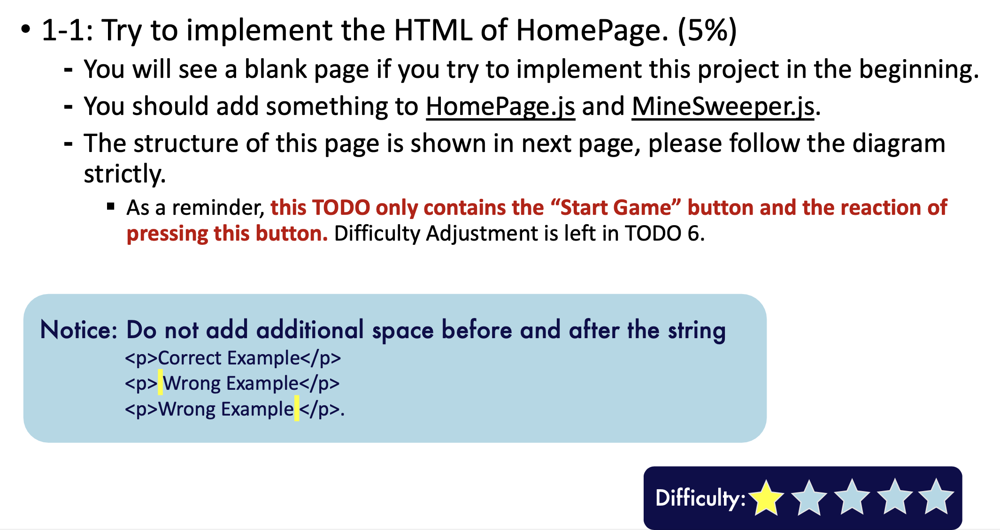
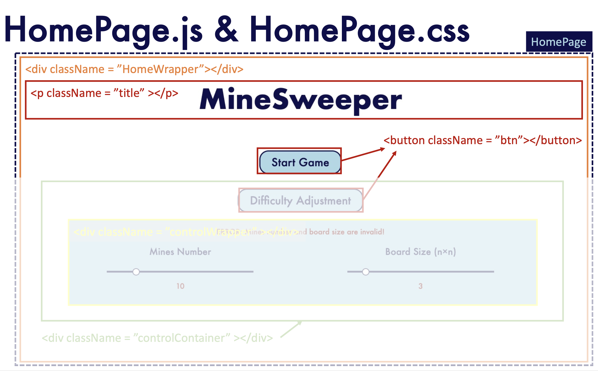
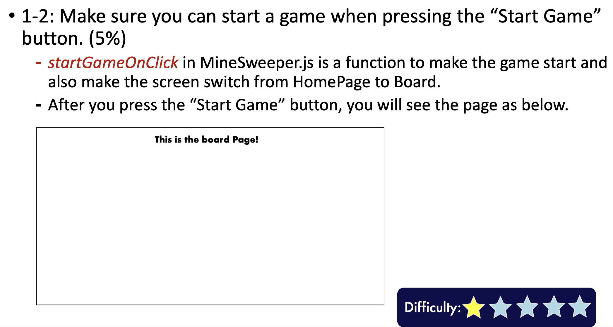

### TODO 2 -- createBoard.js (10%)
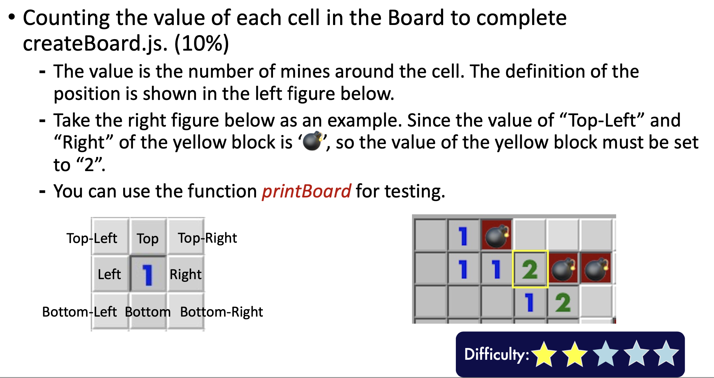

### TODO 3 -- Board.js (20%)
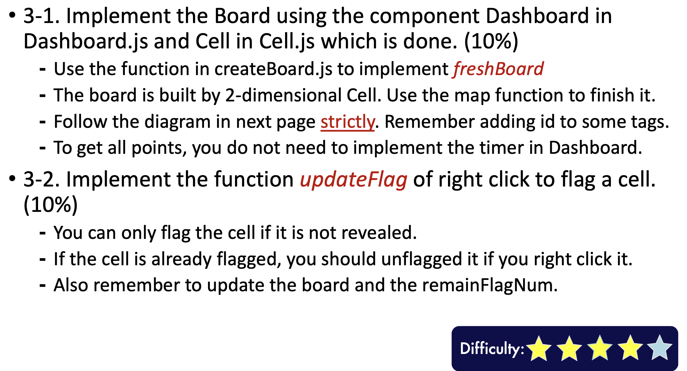
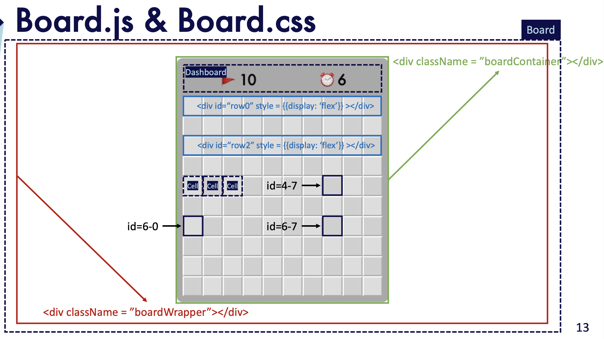

### TODO 4 -- Reveal Cells (25%)
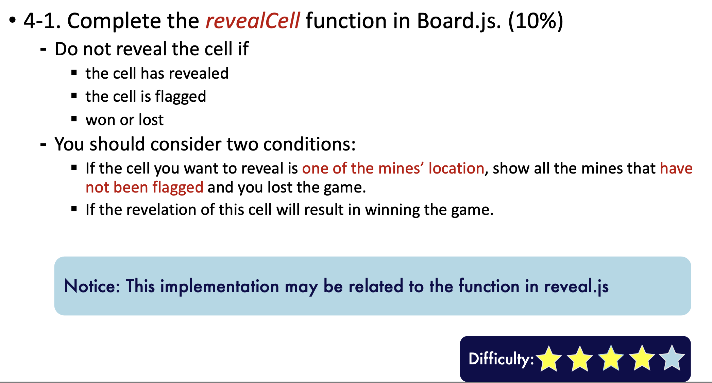
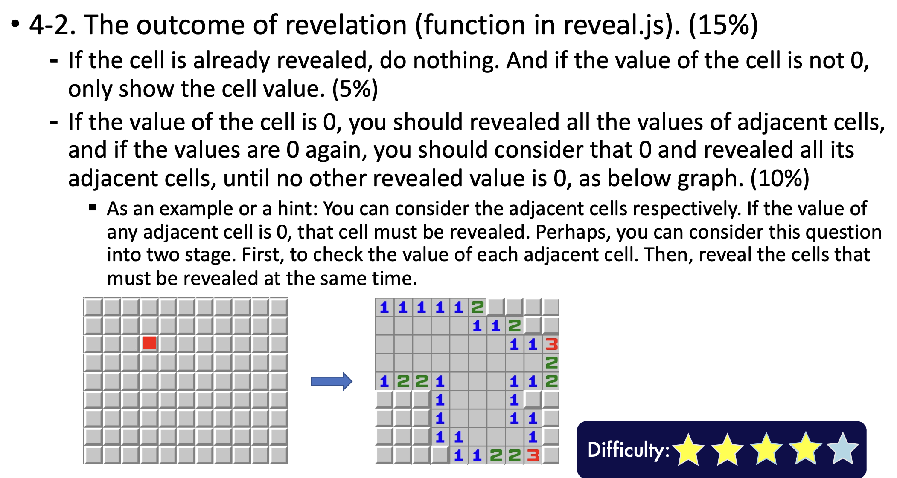

### TODO 5 -- Modal (15%)

5-1: Implement the html of Modal in modal.js. (10%)
    * The structure of Modal must follow the diagram in next page **strictly**. 
    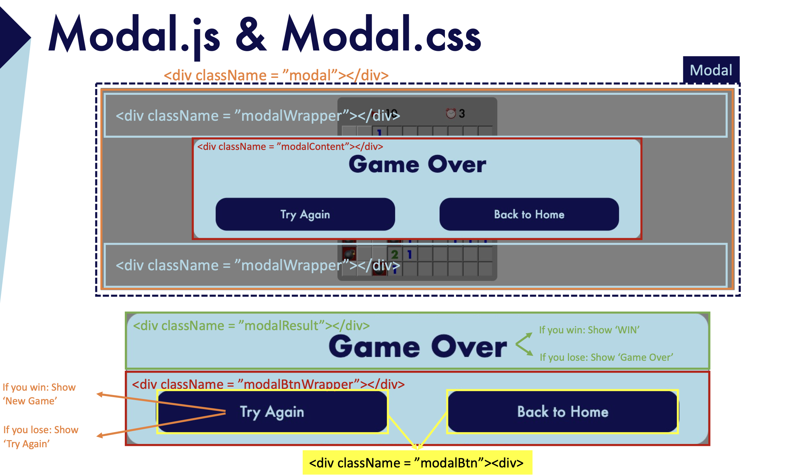
5-2: Two buttons. (5%)
    * Use the function `freshBoard` to implement `restartGame` in Board.js
    * backToHomeOnClick` (in MineSweeper.js) will switch the page back to HomePage and reset all the customized settings (default).

### TODO 6 -- HomePage Control (15%)
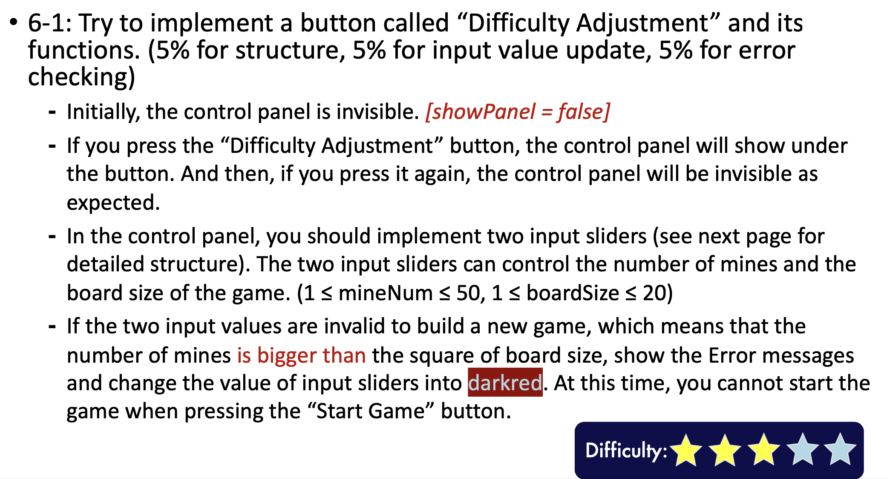
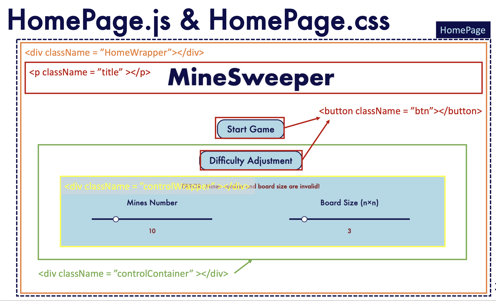
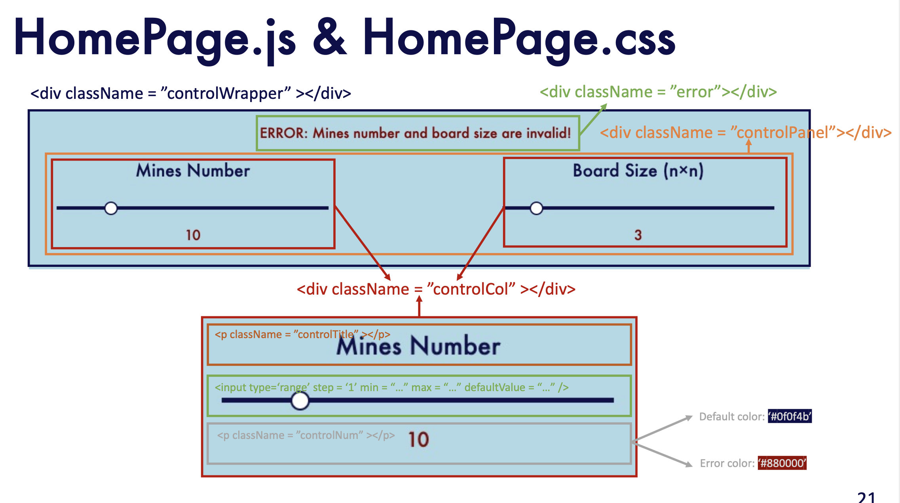
6-2: `mineNumOnChange` and `boardSizeOnChange` (both in MineSweeper.js) are two functions to make the game customized and change the input values synchronously.
    * You should use these two functions to update the values of difficulty.

### TODO 7 -- Dashboard.js (5%)
* Complete the Dashboard (5%)
    ⁃ Make sure the clock will start counting when the game start. ⁃ Also, if the game win or game over, the clock will stop.
    ⁃ If the game is restarted, the clock must be adjusted to 0 and start counting again.

## Cypress
* We only provide a part of testcases
* Almost all tags in ”Static pages” are tested in those provided testcases.
* Passing all testcases definitely unequal to scoring 100% in hackathon. ⁃ There are some private tests
* “npm run test” will perform all tests provided in this hackathon. 
* You can try to implement more tests by cypress.

